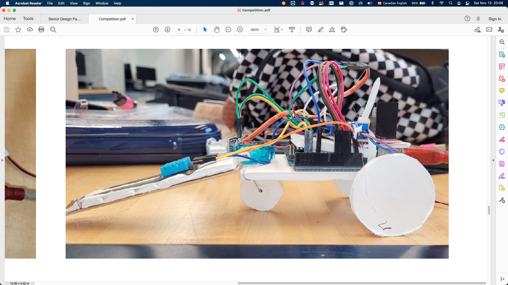

# uOEC 2021 Competition code 
Senior Design

### Team members 
1. Mohamad Ali J.
2. Sebastian L.
3. Juan H.
4. Stefan T.
### Outline 
* To excavate enough dirt to find the moist dirt
* To analyze the dirt to identify whether the quantity of moisture indicates a water source
* To relay the data to a host device
* To perform these tasks autonomously

### Due to time restrictions 
We were unable to complete the scripting, thus the following limitations are in place:
* Communicates to host computer via serial monitor on Arduino IDE
* Receives command from from host system and determines action to perform, returns confirmation of incoming data and returns data when appropriate
* Manually probing for moisture and distance measurement
* Data storage for quantity of moisture detection
* Manual Bot control 
  